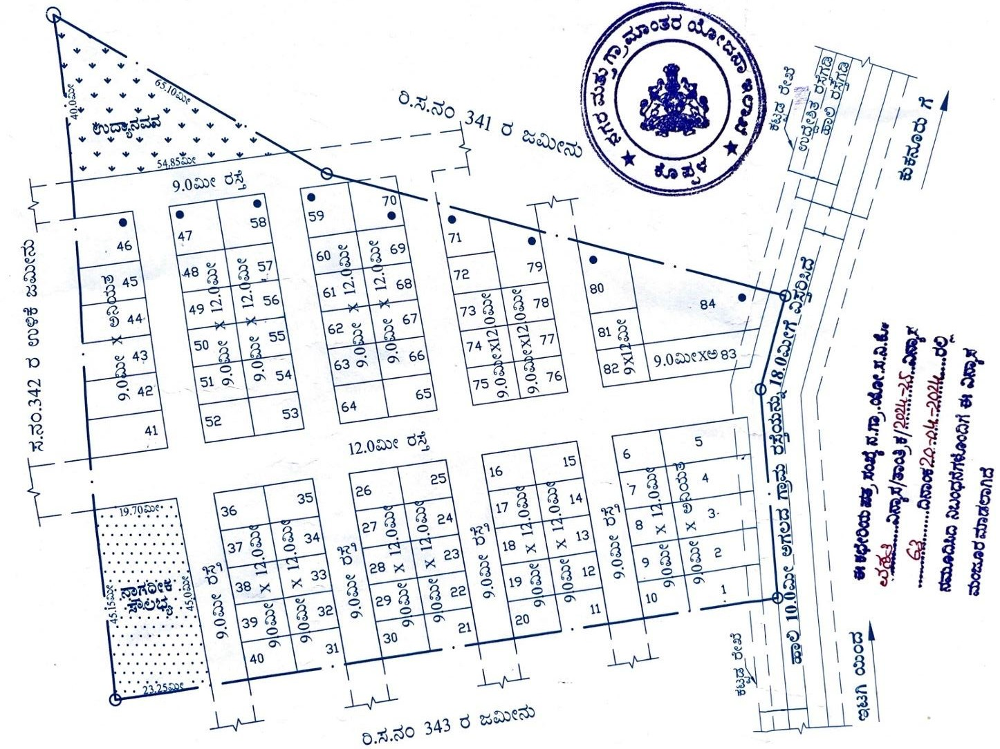

# 🏡 Hakki Layout - Premium Residential Plots

A premium residential layout offering meticulously planned plots in the heart of Kukanoor, Koppal District. Experience luxury living with modern amenities and serene surroundings.

## 🌟 Features

### 🏠 Premium Plots
- **Premium Plots** - 1500+ sq.ft with 40ft road access
- **Corner Plots** - 1200 sq.ft with dual road access
- **Big Size Plots** - 1500+ sq.ft offering maximum comfort

### 🎯 Amenities
- 24/7 Security with CCTV surveillance
- Underground electricity wiring
- 24/7 water supply with pipelines
- Wide roads (30ft - 40ft) with proper drainage
- Beautifully landscaped green spaces
- Gated community living

### 📍 Prime Location
- **2 minutes walk** from Railway Station
- **2 km** from Kukanoor City Center
- **1.5 km** from Shree Mahamaya Temple
- **1 km** from Bus Stand
- Surrounded by green spaces and parks

## 🎥 Virtual Tour

Take a virtual tour of our layout:
[Watch Video Tour](https://youtu.be/rVKUpAlECiU)

## 📞 Contact Information

### Developers & Contacts:
- **Girish Hakki**: +91 74064 29003
- **Ramesh Hakki**: +91 91647 60485
- **Dattanna Hakki**: +91 81056 95122
- **Muttanna Valmiki**: +91 97394 14411
- **Shivaputrappa Ratimani**: +91 94483 22251

### 📧 Email
girish.hakki.knr@gmail.com

### 📍 Address
Hakki Layout, Opposite to Railway Station  
Kukanoor, Dt: Koppal  
Karnataka, India

## 🗺️ Location

[View on Google Maps](https://www.google.com/maps/embed?pb=!1m14!1m12!1m3!1d869.8827629227322!2d75.98832568716936!3d15.484125352634388!2m3!1f0!2f0!3f0!3m2!1i1024!2i768!4f13.1!5e1!3m2!1sen!2sin!4v1763464320228!5m2!1sen!2sin)

## 🌐 Website

Visit our official website:  
[https://girishhakki.github.io/Hakki_Layout/](https://girishhakki.github.io/Hakki_Layout/)

## 📱 Connect With Us

## 🏗️ Project Details

### Plot Specifications
- **Plot Sizes**: 1200 sq.ft to 1500+ sq.ft
- **Road Width**: 30ft to 40ft wide roads
- **Facing**: East facing plots
- **Infrastructure**: Underground utilities
- **Security**: 24/7 gated security

### Payment Options
- Flexible payment plans available
- Easy EMI options
- Transparent pricing
- No hidden charges

## 📋 Gallery

### Main Entrance

### Wide Roads

### Green Spaces

### Infrastructure

## 🚀 Quick Links

- [View Available Properties](#)
- [Schedule Site Visit](#)
- [Download Brochure](#)
- [Contact Sales Team](#)

## 💼 Business Hours

- **Monday - Saturday**: 9:00 AM - 7:00 PM
- **Sunday**: 10:00 AM - 5:00 PM
- **Site Visits**: By appointment

## 📄 Legal Documentation

- Clear titles and documents
- Approved layout plan
- All necessary permissions obtained
- Transparent legal process

## 🤝 Why Choose Hakki Layout?

✅ **Prime Location** - Best connectivity in Kukanoor  
✅ **Modern Amenities** - All essential facilities  
✅ **Secure Environment** - Gated community with 24/7 security  
✅ **Quality Infrastructure** - Well-planned roads and utilities  
✅ **Transparent Dealing** - Clear documentation process  
✅ **Growth Potential** - Excellent investment opportunity  

---

### 📞 **Ready to Book Your Plot?**
Contact us today for site visits and detailed information about available plots and pricing.

**Crafted with 💛 Designed by Girish Hakki**

*© 2025 Hakki Layout. All rights reserved.*
